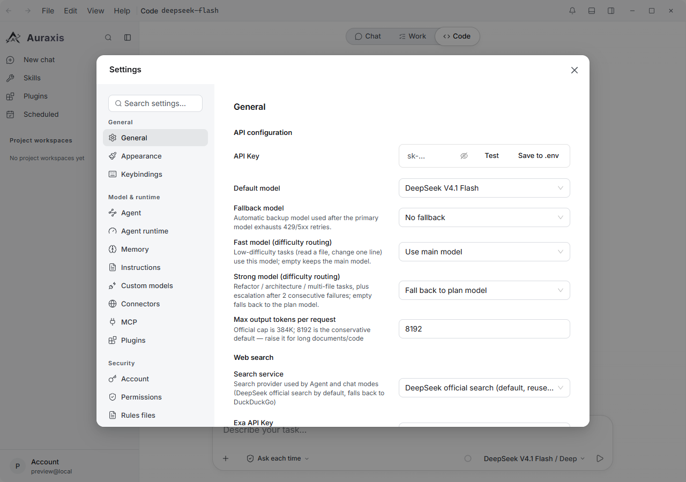
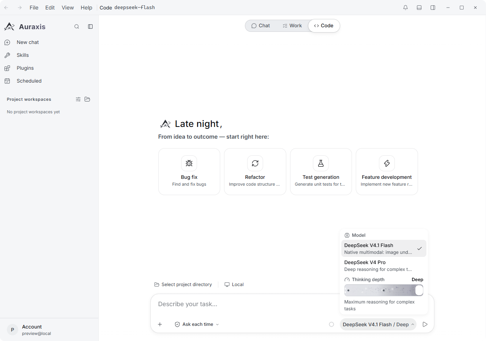

[English](./auraxis.md) | [简体中文](./auraxis.zh-CN.md) · [← Back](../README.md)

# Integrate with Auraxis

Auraxis is an open-source desktop agent workbench for Windows, macOS, and Linux. It drives DeepSeek V4 through three surfaces — **Chat**, **Work**, and **Code** — with multi-agent scheduling, a sandboxed tool pipeline, project workspaces, and a reviewable execution trail. Everything runs locally behind an on-device account.

- **GitHub:** <https://github.com/yth1120/Auraxis-Agent>
- **License:** MIT

#### 1. Install Auraxis

Download the installer for your platform from the [Auraxis releases page](https://github.com/yth1120/Auraxis-Agent/releases):

- Windows (`.exe`)
- macOS (`.dmg` — Intel and Apple Silicon)
- Linux (`.AppImage`)

To run from source you need Node.js 24+ and npm 10+: run `npm install`, then `npm run electron:dev`.

#### 2. Connect your DeepSeek API Key

On first launch Auraxis asks you to create a **local account** (name, email, password). The same screen carries an optional **DeepSeek API Key** field with a **Test connection** button, so you can wire up DeepSeek before you ever reach the workbench — paste a key from <https://platform.deepseek.com/api_keys>, click **Test connection**, and finish setup.

To add or replace the key later:

1. Open **Settings** — the gear icon in the sidebar, or `Ctrl+,`.
2. Go to **General → API configuration**.
3. Paste the key into **API Key** and click **Test**. Auraxis probes DeepSeek's model-list endpoint to confirm the key is live.
4. Pick **DeepSeek V4.1 Flash** (natively multimodal, the default) or **DeepSeek V4 Pro** (deeper reasoning) as the **Default model**.

**Max output tokens per request** defaults to 8192 against an official ceiling of 384000 — raise it for long documents or large code generation.

Auraxis resolves the key in this order: a per-model custom key → the `DEEPSEEK_API_KEY` environment variable → the encrypted `.env` it keeps in its own app-data directory → the value saved in Settings. To point Auraxis at a proxy or self-hosted gateway, set `DEEPSEEK_BASE_URL`; left unset, it talks to DeepSeek's official endpoint.

#### 3. Run your first task

Use the segmented control at the top to pick a mode — **Chat** for plain conversation, **Work** for a task Auraxis plans and delivers for approval, **Code** for repository work through a sandboxed tool pipeline. Auraxis runs DeepSeek with deep thinking enabled by default.

Click the model chip in the composer to open the model and thinking-depth panel:

- **Model** — `deepseek-v4-pro`, or `deepseek-flash` (DeepSeek V4.1 Flash; the retired `deepseek-v4-flash` name is normalized to it).
- **Thinking depth** — three levels. The top level (**Deep**) maps to DeepSeek's `reasoning_effort: "max"`, the middle to `high`, the lowest to `low`.

DeepSeek V4's **1M-token** context window is declared for both built-in models, and the composer's context meter reads against that window as a conversation grows — there is nothing to configure.

#### 4. Going Further

- **Work mode.** Hand over an entire task: Auraxis plans, executes with tools, and delivers the files for approval, with a per-step execution trail you can drill into.
- **Code mode workspaces.** Open a project directory to get the file tree, an integrated terminal, and a diff panel with per-file revert — every write is snapshotted first, so a bad change is one click from being undone.
- **Multi-agent scheduling.** Long tasks fan out into sub-agents with their own pause / resume / stop controls and a shared queue.
- **Web search.** Defaults to DeepSeek's official search and falls back to DuckDuckGo; Exa and Perplexity can be selected in Settings.
- **Headless CLI.** The same engine runs without a window: `Auraxis --run "<task>" --api-key <key>`, with `--reasoning-effort high|max`, `--model <id>`, `--sandbox read|workspace-write|full` and `--api-base=<url>`.
- **Custom models.** Declare additional endpoints — including Anthropic-compatible ones — through the `AURAXIS_MODELS` environment variable.
