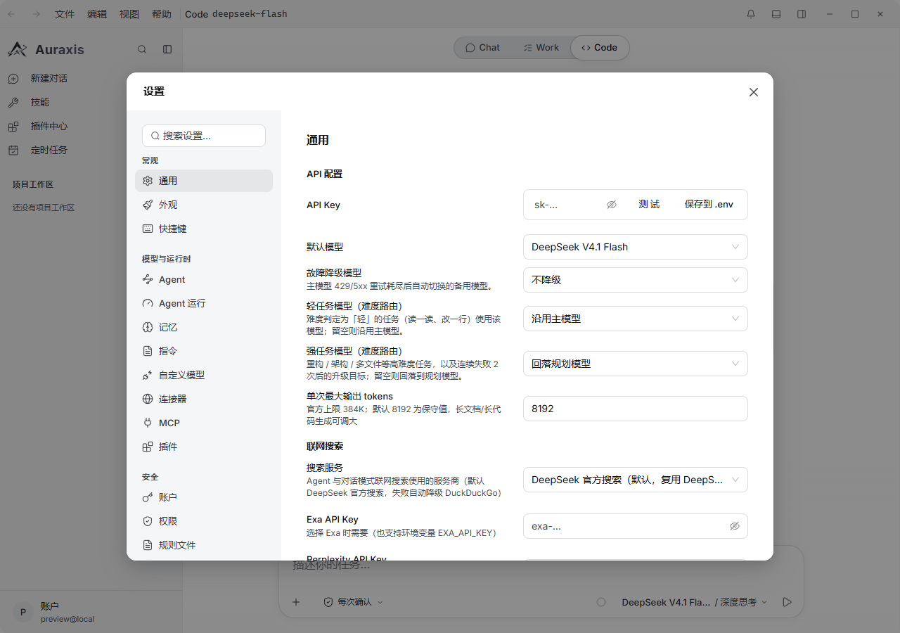
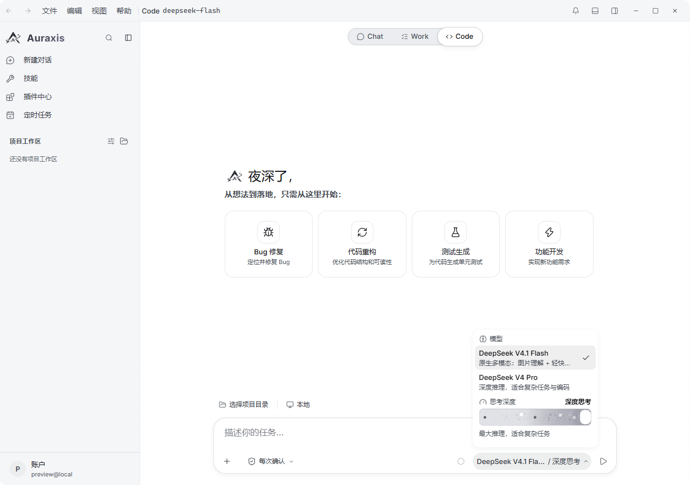

[English](./auraxis.md) | [简体中文](./auraxis.zh-CN.md) · [← Back](../README.zh-CN.md)

# 接入 Auraxis

Auraxis 是一款面向 Windows / macOS / Linux 的开源桌面 Agent 工作台，通过 **Chat**、**Work**、**Code** 三种模式驱动 DeepSeek V4，具备多 Agent 调度、沙箱化工具管线、项目工作区与可回溯的执行轨迹。全部能力在本机运行，账户也保存在本地。

- **GitHub：** <https://github.com/yth1120/Auraxis-Agent>
- **License：** MIT

#### 1. 安装 Auraxis

请从 [Auraxis Releases](https://github.com/yth1120/Auraxis-Agent/releases) 下载对应平台的安装包：

- Windows（`.exe`）
- macOS（`.dmg`，支持 Intel 与 Apple Silicon）
- Linux（`.AppImage`）

从源码运行需要 Node.js 24+ 与 npm 10+：执行 `npm install`，然后 `npm run electron:dev`。

#### 2. 配置 DeepSeek API Key

首次启动时 Auraxis 会要求创建一个**本地账户**（姓名、邮箱、密码）。同一个界面上就带有可选的 **DeepSeek API Key** 字段与 **测试连接** 按钮 —— 你可以在进入工作台之前就把 DeepSeek 接好：把 <https://platform.deepseek.com/api_keys> 里的 Key 粘贴进去，点 **测试连接**，然后完成注册。

之后想补填或更换 Key：

1. 打开 **设置**（侧边栏齿轮图标，或 `Ctrl+,`）。
2. 进入 **常规 → API 配置**。
3. 把 Key 粘贴到 **API Key**，点击 **测试**。Auraxis 会请求 DeepSeek 的模型列表接口来确认 Key 可用。
4. 在 **默认模型** 中选择 **DeepSeek V4.1 Flash**（原生多模态，默认）或 **DeepSeek V4 Pro**（深度推理）。

**单次最大输出 tokens** 默认为 8192，官方上限 384000 —— 长文档或大规模代码生成可以调高。

Key 的解析顺序为：模型级自定义 Key → `DEEPSEEK_API_KEY` 环境变量 → 应用数据目录下加密保存的 `.env` → 设置中保存的值。若要接入代理或自建网关，可设置 `DEEPSEEK_BASE_URL`；不设置时直连 DeepSeek 官方端点。

#### 3. 运行第一个任务

用顶部的分段控件选择模式 —— **Chat** 用于纯对话，**Work** 用于由 Auraxis 自己规划并交付待验收的任务，**Code** 用于经沙箱化工具管线进行的仓库级工作。Auraxis 对 DeepSeek 默认开启深度思考。

点击输入框里的模型胶囊，打开模型与思考深度面板：

- **模型** —— `deepseek-v4-pro`，或 `deepseek-flash`（即 DeepSeek V4.1 Flash；已下线的 `deepseek-v4-flash` 名字会被规范化到它）。
- **思考深度** —— 三档。最高档（**深度思考**）会被映射为 DeepSeek 的 `reasoning_effort: "max"`，中档映射为 `high`，最低档映射为 `low`。

两个内置模型都声明了 DeepSeek V4 的 **1M** 上下文窗口，输入框的上下文计量条会随对话增长按该窗口读数，无需任何额外配置。

#### 4. 进阶用法

- **Work 模式**：把一整件事交出去 —— Auraxis 规划、用工具执行、把产出文件交给你验收，每一步都有可下钻的执行轨迹。
- **Code 模式工作区**：打开项目目录即可获得文件树、集成终端与带逐文件回滚的变更面板 —— 每次写入前都会先打快照，改坏了点一下就还原。
- **多 Agent 调度**：长任务会派发为子 Agent，各自可暂停 / 继续 / 停止，队列共享。
- **联网搜索**：默认使用 DeepSeek 官方搜索，失败自动降级 DuckDuckGo；Exa 与 Perplexity 可在设置中选择。
- **无头 CLI**：同一套引擎可无窗口运行 —— `Auraxis --run "<任务>" --api-key <key>`，另有 `--reasoning-effort high|max`、`--model <id>`、`--sandbox read|workspace-write|full` 与 `--api-base=<url>`。
- **自定义模型**：通过 `AURAXIS_MODELS` 环境变量声明额外端点（含 Anthropic 兼容格式）。
